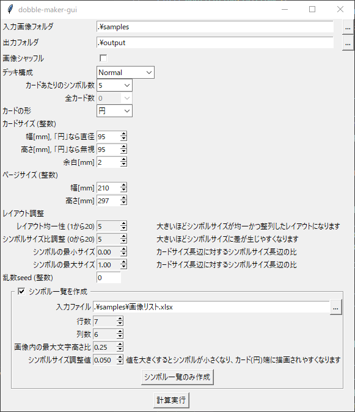

# dobble-maker

ボードゲーム ドブル (Dobble / Spot it!) の Python 実装です。

ドブルは全 55 枚のカードで構成されています。
各カードには 8 個ずつの画像（シンボル）が描かれていて、そのうちどの 2 枚を選んでも、必ず 1 個のシンボルが共通して存在する構成となっています。

dobble-maker では、任意の画像、カード当たりのシンボル数でカードデッキを構築し、印刷用の PDF を生成します。

# できること

- カードに配置するシンボルに好きな画像を指定可能
- カード 1 枚当たりのシンボル数を任意に指定可能
- カードのサイズを円、または長方形で任意サイズを指定可能
- カード内に程よく均等かつランダムに配置
- カード毎の画像、及び任意サイズの PDF ファイルを出力

**カード 1 枚当たりのシンボル数`n=4`で円形の場合に、A4 指定で出力される PDF の 1 ページ目**

**`n=5`の場合**

**`n=5`で長方形（トランプサイズ）の場合**

# 使い方

## ツールの入手と実行

1. [Release - dobble-maker](https://github.com/youce23/dobble-maker/releases) から `dobble_maker_gui_v*.zip` をダウンロード
2. zip ファイルを任意のフォルダに解凍
3. 解凍されたフォルダ内の`dobble_maker_gui.exe`を実行

## パラメータの説明

`dobble_maker_gui.exe`を実行するとパラメータを入力する画面が表示されるので、入力後、`計算実行`ボタンで画像が生成されます。

以下の通りにパラメータを指定すると、同梱の`samples`[^sample_source]を入力として`output`にカード毎の画像と PDF ファイル（A4 縦）が生成されます。

[^sample_source]: サンプル画像の入手元: [いらすとや](https://www.irasutoya.com/)

- 入力画像フォルダ
  - カードに描画するシンボル画像 (JPG または PNG) が保存されたフォルダを指定
    - `カード当たりのシンボル数` を `n` とした場合に、 `n * (n - 1) + 1` 個以上の画像が必要なので、あらかじめ準備しておく
  - 画像 の背景は白 `(255, 255, 255)` あるいは透過であること
- 出力フォルダ
  - カード画像や PDF ファイルを保存するフォルダを指定
- 画像シャッフル
  - チェックを入れると、入力画像フォルダにある画像から使用する画像をランダム選択する
- カード当たりのシンボル数
  - カード 1 枚に描画するシンボル数を指定
    - `2 あるいは 素数の累乗 + 1`であることが条件
  - 例えばドブルキッズは`n = 6`、通常のドブルは`n = 8`で構成されている
- カードの形
  - 生成するカードの形状を指定
- カードサイズ
  - 印刷するカードのサイズを mm で指定
  - 計算時間が画像サイズに比例するため、動作確認やパラメータ調整時は小さめ（30mm など）に設定すると良い
- ページサイズ
  - PDF ファイルの紙サイズ mm で指定
  - 例えば A4(縦)なら (幅 210mm, 高さ 297mm)、A3(横)なら(幅 420mm, 高さ 297mm)を指定する
- レイアウト調整
  - 以下は初期値を基準に、1 か所だけ値を変えて生成、を繰り返して調整するのが良い
  - レイアウト均一性
    - カードに描画するシンボルのサイズ及び配置の均一性を調整するパラメータ
    - 値が小さいとサイズがバラバラで位置がランダムに、大きいと均一かつ整列されやすくなる
  - シンボルサイズ比調整
    - カードに描画するシンボル間のサイズ比を調整するパラメータ
    - 0 では全てのシンボルのサイズが等しく、大きくするとシンボル間のサイズに差が生じやすくなる
- 乱数 seed
  - カードのシンボル配置や画像シャッフルで選択される画像を別パターンにしたい場合、この値を変更する
