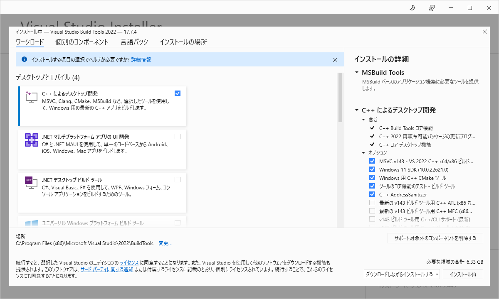

# ビルド手順書

GUI 版 dobble-maker (dobble_maker_gui.py) のビルド手順のまとめ (PyInstaller 使用[^about_nuitka])

[^about_nuitka]: nuitka も試したが exe の生成に失敗したので PyInstaller にした（`galois`が使っている`numba`が主原因？）

動作確認環境

- OS: Windows 10 Home
- 仮想環境: pipenv 2023.8.26 + 同梱の Pipfile, Pipfile.lock
  - `.venv`フォルダに仮想環境が構築されているものとする

## Bootloader のリビルド + PyInstaller のインストール

PyInstaller をそのまま使うと実行ファイルに対してウィルス検知され exe が削除される場合がある。
これは PyInstaller に内包される Bootloader を再コンパイルすると回避できる。

MinGW (gcc) あるいは Visual Studio C++ コンパイラ (msvc) などでコンパイルできるが、MinGW では後述する`python ./waf distclean all`で gcc が認識されなかったため VS C++ コンパイラ を使う（PyInstaller 公式でも MinGW ではなく[vc コンパイラを使っている](https://www.pyinstaller.org/en/stable/bootloader-building.html#building-for-windows)）

### VisualStudio C++ コンパイラ のインストール

[公式](https://www.pyinstaller.org/en/stable/bootloader-building.html#build-using-visual-studio-c)ではパッケージマネージャとして`Chocolatey`を使う方法が紹介されていたが、vcbuildtools のインストールに失敗したため以下の方法で行う

1. [Build Tools for Visual Studio](https://visualstudio.microsoft.com/ja/downloads/)をダウンロード、実行
2. `C++によるデスクトップ開発`にチェックを入れてインストール

   

### PyInstaller を git clone

`.venv\Lib\site-packages`に PyInstaller のソースを clone

```cmd
git clone https://github.com/pyinstaller/pyinstaller
```

### Bootloader をリビルド

`.venv\Lib\site-packages\pyinstaller\bootloader`で以下を実行

```cmd
python ./waf distclean all
```

成功すると`bootloader\build`の`debug`, `debugw`, `release`, `releasew`にそれぞれ`run_d.exe`, `runw_d`, `run.exe`, `runw.exe`が生成される

### PyInstaller をインストール

1. 仮想環境`.venv`を有効化
   1. `dobble-maker\.venv`に仮想環境があるなら、`dobble-maker`直下で`pipenv shell`を実行
2. `.venv`があるフォルダ (`dobble-maker`) をカレントとして以下を実行
   ```cmd
   pipenv install -e .venv\Lib\site-packages\pyinstaller
   ```
   これにより、仮想環境にローカルビルドした Bootloader の PyInstaller がインストールされる

## exe の生成

1. `build.bat`を実行
   1. `dobble-maker`直下で`pipenv run pip list`でインストール済みパッケージを確認し、不要なものは`exclude-module`で追加する（軽量化、ライセンスの整理が狙い）
2. 成功すると`dobble-maker\release`に`dobble_maker_gui.exe`が生成される

## ライセンスについて

外部パッケージのライセンスは以下の手順で`dobble-maker\release\LICENSES`に追加する

1. `dobble-maker`直下で`pipenv run pip list`を実行しインストール済みパッケージの一覧を確認
2. `build.bat`で`exclude-module`指定のパッケージは exe に含まれないためこれらを上記の一覧から除外
3. 残ったパッケージが exe に内包されるので、`.venv\Lib\site-packages`から該当パッケージのライセンスファイルを`release\LICENSES`以下にコピーする
